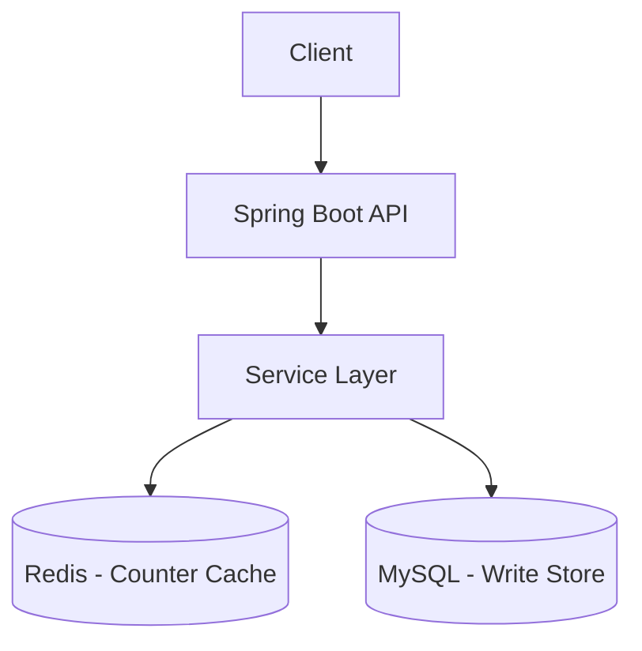
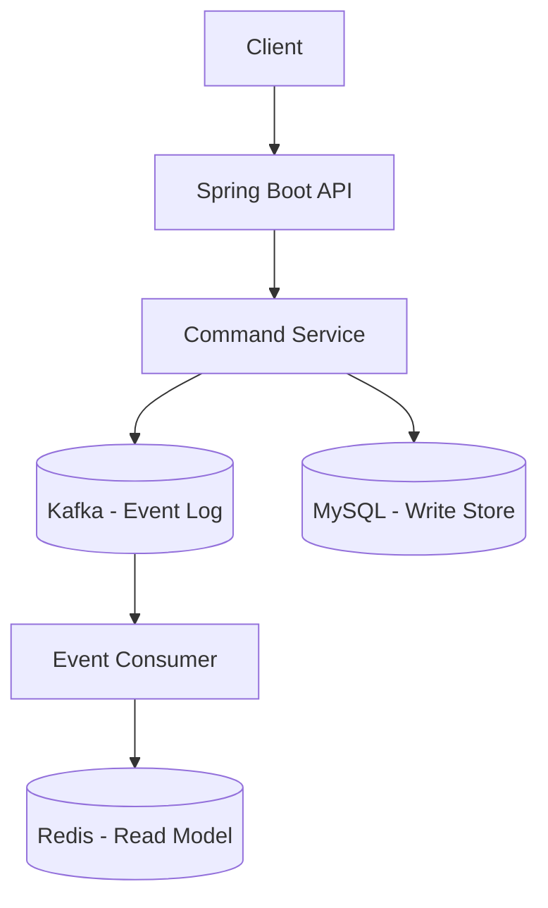
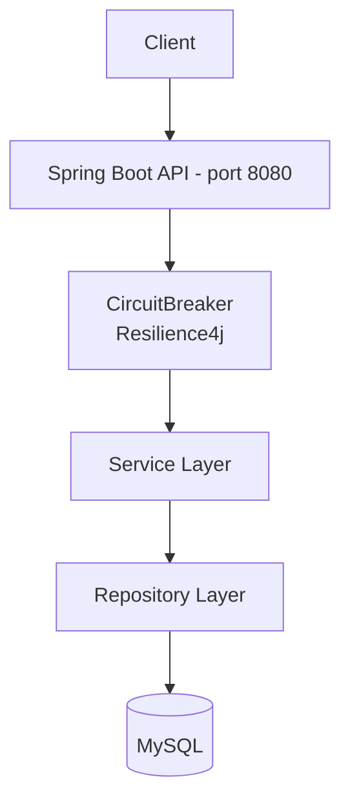

You are an expert Principal Systems Architect and Java/Spring Specialist. Generate a comprehensive, production-grade High-Level Design (HLD) document for a Spring Boot application or feature. Focus strictly on system architecture, component boundaries, data flow, and Spring-specific framework decisions. Do NOT write any low-level code or method implementations.

The system/feature to design is: [INSERT SYSTEM OR FEATURE]

## Rules
- Do NOT write any code or LLD (no method signatures, no SQL DDL, no Sequence or Activity diagrams).
- Do NOT invent features beyond what is stated. Ask if unclear. Also give an option text field to input the answer on his own.
- Use concrete names (class names, endpoint paths, Docker image names) — never generic placeholders.
- All Mermaid diagrams must be syntactically valid. Use ` ` for multi-line labels. Never use `\n`, `:` in subgraph titles, `[` or `]` in participant aliases, or special characters (`—`, `·`, `≤`) inside diagram syntax.
- NFRs must have measurable targets — no vague terms like "fast" or "scalable".
- Architecture options must compare design patterns, technology choices, and DB choices — NOT just monolith vs microservices.
- Include Resilience4j patterns (Circuit Breaker, Retry, Bulkhead) and architectural principles (CQRS, Saga Orchestration) where applicable.

## Step 1 — Explore (if codebase exists)
Before generating, scan the workspace for:
- `@SpringBootApplication`, `@RestController`, `@Service`, `@Repository`, `@Entity`
- `Dockerfile`, `compose.yaml`, `application.properties` / `application.yml`
- `pom.xml` — Spring Boot version, key dependencies

## Step 2 — Identify Gaps
Ask the user for anything that cannot be inferred:
- SLA targets (latency p99, uptime %)
- Expected concurrent users / traffic scale
- Auth mechanism if not present in code
- Deployment target (Docker Compose, K8s, cloud)

## Step 3 — Produce HLD

- Present architecture options comparing design patterns, technology/DB choices, and trade-offs — recommend one with engineering justification.
- Include Resilience4j (Circuit Breaker, Retry, Bulkhead), CQRS, Saga Orchestration, and other relevant architectural principles in both the document and diagrams.
- Write the output to `docs/HLD.md` using this exact structure:

---

# HLD: {System Name}

**Version:** 1.0 | **Date:** {date} | **Stack:** {stack}

---

## 1. Architectural Overview & Style

- Define the core architectural style (e.g., Spring Boot Layered, Hexagonal, CQRS, Event-Driven).
- Justify why this structural pattern fits the specific problem within the Spring ecosystem.

---

## 2. Architecture Options & Trade-off Evaluation

Present **2 to 3 alternative approaches** comparing design patterns,CAP theorem, technology, and DB choices (not monolith vs microservices).

For each option, provide:
1. A summary table row
2. A dedicated **Pros / Cons** list
3. A **Mermaid architecture diagram** showing its specific component topology

Mark the recommended option clearly with `⭐ RECOMMENDED`.

---

### Option A: {Name} — e.g. Standard Layered + Outbox + Redis

**Pros:**
- e.g. Simple Spring MVC stack — fast to implement
- e.g. Redis INCR gives atomic counter updates without distributed transactions
- e.g. Transactional Outbox guarantees no counter drift on Redis restart

**Cons:**
- e.g. Two datastores to operate (MySQL + Redis)
- e.g. OutboxProcessor polling adds up to 5s counter lag
- e.g. Scale ceiling ~50K concurrent users on single node

---

### Option B: {Name} — e.g. CQRS + Kafka Event-Driven ⭐ RECOMMENDED (or whichever fits)

**Pros:**
- e.g. Write path and read path fully decoupled - scales independently
- e.g. Kafka event log gives full audit trail and replay capability
- e.g. Read model can be any store - Redis, Elasticsearch, etc.

**Cons:**
- e.g. Three datastores (MySQL + Kafka + Redis) — high operational cost
- e.g. Eventual consistency on counters - harder to reason about
- e.g. Consumer lag management and dead-letter topics add complexity

---

### Comparison Summary

| Dimension | Option A | Option B |
|-----------|----------|----------|
| Pattern | e.g. Standard Layered + Outbox | e.g. CQRS + Event-Driven |
| DB | e.g. MySQL + Redis | e.g. MySQL + Kafka + Redis |
| Resilience | e.g. Circuit Breaker + Retry + Bulkhead | e.g. Same + DLQ handling |
| Consistency | e.g. Near-real-time via Outbox | e.g. Eventual via Kafka consumer |
| Complexity | Low-Medium | High |
| Scale ceiling | ~50K concurrent users | 500K+ users |
| Recommended | e.g. Yes / No | e.g. Yes / No |

**Chosen approach:** ⭐ Option X — one sentence engineering justification.

---

## 3. Architecture Diagram — Recommended Approach

Produce the full production diagram for the chosen option, including: Spring layers, Resilience4j components (Circuit Breaker, Bulkhead, Retry), CQRS read/write paths, Saga steps, or messaging where applicable. Use ` ` for multi-line node labels. Do NOT use `\n`, `:` in subgraph titles, `[` or `]` in participant aliases, or special characters (`—`, `·`, `≤`) inside diagram syntax.

---

## 4. Spring Component Boundaries & Responsibilities

| Layer | Class / Package | Responsibility |
|-------|----------------|----------------|
| Controller | `com.example.controller.*` | REST endpoints, input validation, request/response serialization |
| Service | `com.example.service.*` | Business logic decoupled from presentation and data access; `@Transactional` boundaries |
| Repository | `com.example.repository.*` | Spring Data JPA/R2DBC abstraction; indexing strategy; transaction scope |
| Config / Security | `com.example.config.*` | Spring Security, OAuth2, `@ControllerAdvice` global exception handling |
| Resilience | `com.example.resilience.*` | Resilience4j Circuit Breaker, Retry, Bulkhead configuration beans |

---

## 5. API Contract Summary

| Method | Path | Auth | Description |
|--------|------|------|-------------|
| GET | `/api/v1/...` | Bearer JWT | Description |
| POST | `/api/v1/...` | Bearer JWT | Description |

*Full contract: Swagger UI at `/swagger-ui.html`*

---

## 6. Data Architecture & Persistence Strategy

| Entity | Key Fields | Relationships | Indexing | Notes |
|--------|-----------|---------------|----------|-------|
| `Entity` | id, field1, field2 | One-to-Many → Other | Index on (field1) | `@Version` for optimistic lock if concurrent writes |

- **Storage choice:** Relational (PostgreSQL/MySQL) / NoSQL (MongoDB) / Cache (Redis) — justify.
- **Data retention policy:** X days/years per entity type.
- **CQRS split** (if applicable): write model → normalized DB; read model → denormalized projection or Redis cache.

---

## 8. Security Design

| Concern | Mechanism |
|---------|-----------|
| Authentication | JWT / OAuth2 / Session |
| Authorization | Role-based (`@PreAuthorize`) |
| Transport | HTTPS TLS 1.2+ |
| Secrets | Env vars — never hardcoded |

---

## 9. Non-Functional Requirements & Spring Optimizations

| Attribute | Target | Spring Mechanism |
|-----------|--------|-----------------|
| Latency p99 | < Xms | Tomcat thread-pool tuning / WebFlux non-blocking I/O |
| Throughput | X req/sec | Connection pool sizing (HikariCP), Redis cache |
| Availability | XX.X% monthly | Resilience4j Circuit Breaker + Retry |
| Concurrent users | X,XXX | Bulkhead pattern — isolate thread pools per service |
| Observability | Structured logs + metrics | Spring Boot Actuator, Micrometer, Prometheus `/actuator/prometheus` |
| Data retention | X days/years | Compliance baseline |

---

## 10. Infrastructure & Deployment

| Component | Technology | Config |
|-----------|-----------|--------|
| Runtime | Spring Boot {version}, JDK 21 | Embedded Tomcat / Netty (WebFlux) |
| Container | Docker | `Dockerfile` |
| Orchestration | Docker Compose / K8s | `compose.yaml` |
| Database | MySQL / PostgreSQL {version} | Port 3306 / 5432 |
| Cache | Redis {version} | Port 6379 |
| Observability | Actuator + Prometheus | `/actuator/prometheus` |

---

## 11. Known Limitations & Scale-Up Path

| Limitation | Current Mitigation | Future Path |
|-----------|-------------------|-------------|
| Single instance | Rate limiter | Horizontal scale + load balancer |
| Synchronous writes | Acceptable at MVP scale | Add Kafka + Saga orchestration for async event processing |
| No CQRS split | Single DB for read/write | Introduce read replica + separate query model |

---

## Quality Checklist
- [ ] Mermaid diagrams compile without errors
- [ ] All `@RestController` endpoints appear in API summary
- [ ] All `@Entity` / data model entries present
- [ ] Security mechanism explicitly stated (or marked N/A with reason)
- [ ] NFRs have concrete numbers, not vague descriptors
- [ ] Resilience4j patterns (Circuit Breaker / Retry / Bulkhead) included where failure modes exist
- [ ] Architecture trade-off table present with clear recommendation
- [ ] Critical flow sequence diagram covers the highest-risk operation

---

<!-- ## 3 Deep Architectural Review Questions

At the very end, list exactly 3 deep architectural questions about this Spring setup for team/interviewer review. At least one must probe a resilience or concurrency trade-off. -->

Note for generators:
- When producing the final HLD, write the full document to a new file in this repository under the `/docs` folder (choose a descriptive filename, e.g., `HLD-<system>.md`). Do NOT print the document contents in the chat console; instead reply only with the created file path and a one-line confirmation that the file was written.
