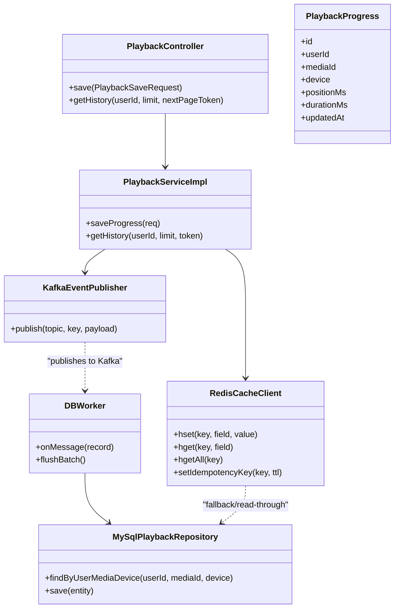
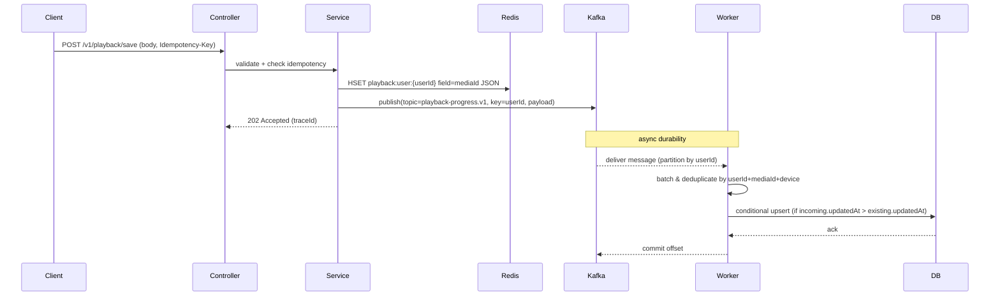
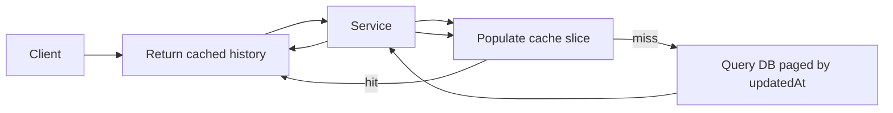

# Low-Level Design: Playback Progress Service

Version: 1.0
Author: Staff Engineer
Date: 2026-07-08

Purpose
-------
This document captures the low-level design (LLD) for the Playback Progress Service implementing save/fetch of video playback progress across devices with low latency and high availability.

This LLD expands the HLD and functional/non-functional requirements saved in project memory: core flows (ingest + query), components (Redis, Kafka, DB worker, MySQL/Dynamo-like persistence), API contract, data model, operational concerns and test strategy.

Requirements (summary)
----------------------
- Functional
  1. Save/Fetch playback progress (per user, per media, per device)
  2. Support multiple devices (TV, Mobile) — many concurrent records
  3. Support Movies & Episodes as media types
  4. Home page: return list of media items with recent playback state
- Non-functional
  1. Highly available (AP-focused where possible)
  2. Low latency target: 50ms for hot reads
  3. DAU target ~10M users -> ~100 TPS sustained
  4. Storage sizing: ~100k media items (long-term persisted data scaled separately)

System Components
-----------------
- API Gateway / Load Balancer
- Playback Ingestion Service (HTTP REST)
- Playback Query Service (HTTP REST)
- Redis Cluster — primary hot store for reads/writes (HSET per user)
- Kafka (or pluggable message bus) — decouples hot path from persistence
- DB Worker / Consumer — batches and persist to durable store
- Durable Store — relational (MySQL) or NoSQL (DynamoDB) as ground-truth
- Monitoring & Tracing: OpenTelemetry + Micrometer + Prometheus + Grafana
- AuthZ/AuthN: JWT-based scopes (playback:write, playback:read)

Data Model
----------
We keep a compact playback record for both cache and persistent store.

PlaybackProgress entity (DB / JSON)
- id: Long (DB PK)
- userId: Long
- mediaId: String
- device: String (TV / MOBILE / WEB) optional
- positionMs: Long
- durationMs: Long
- createdAt: Instant
- updatedAt: Instant
- version: Long (optimistic locking)

Redis cache layout (per-user Hash)
- Key: `playback:user:{userId}`
- Field: `{mediaId}:{device}` (or simply `mediaId` if device is embedded)
- Value: serialized PlaybackProgress JSON

Kafka topic(s)
- `playback-progress.v1` — ingest topic; partition by `userId` to maintain per-user ordering
- `playback-progress-dlq.v1` — dead-letter for events that cannot be persisted after retries

Database schema (MySQL example)
- Table: `playback_progress`
  - id BIGINT AUTO_INCREMENT PRIMARY KEY
  - user_id BIGINT NOT NULL
  - media_id VARCHAR(200) NOT NULL
  - device VARCHAR(50)
  - position_ms BIGINT
  - duration_ms BIGINT
  - created_at TIMESTAMP
  - updated_at TIMESTAMP
  - version BIGINT
  - UNIQUE(user_id, media_id, device)
  - INDEX(user_id, updated_at DESC)

APIs
----
1) POST /v1/playback/save
- Auth: bearer JWT with scope `playback:write`
- Body: `PlaybackSaveRequest { userId, mediaId, positionMs, durationMs, device?, updatedAt? }`
- Behaviour:
  - Validate request
  - Idempotency: honor `Idempotency-Key` header via Redis TTL key
  - Rate-limit per-user (1 r/s steady, burst 5/10s) via Redis
  - Hot-path: HSET to Redis key `playback:user:{userId}` (field mediaId -> JSON)
  - Publish event to Kafka keyed by `userId` for durability
  - Return 202 Accepted with `X-Trace-Id`

2) GET /v1/playback/history?userId={userId}&limit={limit}&nextPageToken={token}
- Auth: bearer JWT with scope `playback:read`
- Behaviour:
  - Attempt `HGETALL playback:user:{userId}`
  - If present, sort by `updatedAt` and return first N entries + encoded nextPageToken
  - If cache-miss, query DB (paged by updatedAt desc), populate cache for the returned slice

Worker Behaviour (DBConsumer)
----------------------------
- Consumers join Kafka group `playback-dbworker`, partitioned by `userId` for ordering
- On message: deserialize PlaybackProgress
- Merge strategy: deduplicate within a batch by `userId+mediaId+device`, keep the record with the latest `updatedAt`
- Batching: aggregate until batch-size (configurable, e.g., 100) or flush-interval (e.g., 5s)
- Persist logic per item:
  - Attempt to read existing DB row by `(userId, mediaId, device)`
  - If missing, insert new row with createdAt=now, updatedAt=incoming.updatedAt
  - If present and incoming.updatedAt > existing.updatedAt => update position/duration/updatedAt
  - Use optimistic locking (`version`) to prevent lost updates
- Retries: on DB error retry per-item N times (configurable); final failures publish to DLQ

Idempotency & Rate-Limiting
---------------------------
- Idempotency: `Idempotency-Key` header stored as `playback:idempotency:{userId}:{key}` with TTL (default 60s). If set already -> return 202 Accepted
- Rate-limiter: Redis-based counters per time-bucket
  - 1s bucket key: `playback:rate:1s:{userId}:{epoch-sec}` limit 1
  - 10s bucket key: `playback:rate:10s:{userId}:{epoch-10sec}` burst limit 5
  - On Redis failure, allow request (fail-open) to avoid breaking UX, but emit SLO alerts

Consistency & Concurrency
-------------------------
- Hot path writes to Redis are considered the freshness source for read operations; DB is eventually consistent.
- Worker ensures monotonicity by comparing `updatedAt` timestamps before writes.
- Use optimistic locking in DB (`@Version`) to avoid lost updates across multiple worker instances.

Observability
-------------
- Tracing: propagate `X-Trace-Id` across ingestion -> publish -> worker -> DB writes (OpenTelemetry)
- Metrics (Micrometer): counters/histograms
  - `playback.save.requests` (counter)
  - `playback.save.latency` (histogram)
  - `playback.cache.hits`, `playback.cache.misses`
  - `playback.producer.success`, `playback.producer.failure`
  - `playback.worker.batch.size`, `playback.worker.flush.latency`
- Logs: structured JSON with fields {traceId, userId, mediaId, op, latencyMs, status}
- Alerts: consumer lag, DLQ growth, producer failures rate, high cache misses

Security
--------
- Authorization scopes enforced at API Gateway or controller: `playback:write`, `playback:read`
- Input validation using Jakarta Validation (`@NotNull`, `@Size`, `@Min`)
- Network: TLS for inter-service and client communication; secure Kafka + Redis with access controls in prod

Deployment & Infra
------------------
- Local dev: docker-compose services for MySQL, Redis, (and optionally Kafka)
- Prod: Redis Cluster (sharded, replication), Kafka cluster (topic partitions sized by expected throughput), persistent DB (managed MySQL or DynamoDB for scale)
- Horizontal scaling: stateless ingestion and query services scaled by CPU and request volume; workers scale by partitions assigned
- Persistence sizing and partitioning:
  - For relational store, partitioning/sharding by userId range if needed
  - For DynamoDB, use PK=USER#{userId}, SK=MEDIA#{mediaId} and GSIs for query patterns

Testing Strategy
----------------
- Unit tests: controller + service + repository mocks (JUnit5 + Mockito)
- Integration tests: Testcontainers for Redis, Kafka and MySQL to validate ingestion->worker->persistence
- Load tests: simulate 100 TPS sustained, burst traffic; validate latency and DLQ behaviour
- Chaos tests: simulate Redis/Kafka outages to verify graceful degradation and DLQ

Configuration (example properties)
----------------------------------
playback.topic=playback-progress.v1
playback.dlq-topic=playback-progress-dlq.v1
playback.worker.batchSize=100
playback.worker.flushMs=5000
playback.publish.retries=3
playback.idempotency.ttlSeconds=60

Open design notes & tradeoffs
----------------------------
- Using Redis as the hot store gives low-latency reads/writes, but increases complexity to keep DB eventually consistent — the worker handles durability and resolution.
- Ordering per-user is preserved by partitioning Kafka by `userId` and assigning workers accordingly.
- The system favors availability and low latency for reads (AP) while using eventual persistence to ensure durability (tunable consistency).
- For very high scale and geo-distribution, replace Redis with a globally replicated cache (e.g., Redis Enterprise/GCP Memorystore with cross-region replication) or use a storage tier with multi-region capabilities.

Appendix
--------
- Example persistence conditional logic (pseudocode):

  if existing == null:
      insert(record)
  else if record.updatedAt > existing.updatedAt:
      update(existing.positionMs = record.positionMs, existing.updatedAt = record.updatedAt)

- Sequence (ingest):
  Client -> API -> validate -> Redis HSET -> publish Kafka -> return 202
  Worker consumes Kafka -> batch/merge -> conditional DB write -> ack

---

For operational runbooks, CI hints, and migration scripts see `/docs` and the `compose.yaml` for local development.

Class Diagram
-------------

Sequence / Flow Diagrams
------------------------
Ingest (save) hot-path and durability flow:

Read (history) flow:

