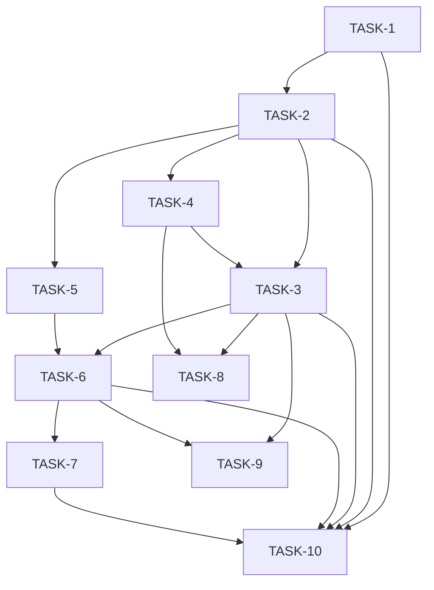

# TASKS: Playback Progress Service Implementation

Version: 1.0
Author: Senior Tech Lead
Date: 2026-07-08

## 1. Implementation Phases Overview

- Phase 1 — Foundation: infra and core persistence slice (DynamoDB table + local integration). Enables vertical slices to run end-to-end. (LLD Sections: 4,11)
- Phase 2 — Ingestion & Hot Path: implement `POST /v1/playback/save`, Redis writes, Kafka publish, and unit tests. (LLD Sections: 3,4,5)
- Phase 3 — Worker & Persistence: implement DBWorker consumer, batching, conditional writes to DynamoDB, DLQ handling. (LLD Sections: 4,4.3,6)
- Phase 4 — Query & Read Path: implement `GET /v1/playback/history`, cache lookup, fallback to DynamoDB, pagination. (LLD Sections: 5,4)
- Phase 5 — Resilience, Observability & Security: add tracing, metrics, rate-limiting, idempotency, and CI tests. (LLD Sections: 9,10,8)

Rationale: Phase order delivers a vertical, testable feature quickly: create storage schema (Phase 1), implement write path + cache ack (Phase 2), make writes durable (Phase 3), provide read UX (Phase 4), and harden/observe (Phase 5).

## 2. Task Breakdown

### TASK-1: Create DynamoDB Table & Local Test Fixture
- **Phase:** Foundation
- **Type:** DB Migration / DevOps
- **LLD Reference:** Section 4 — Database schema
- **Description:** Create `PlaybackProgress` DynamoDB table schema locally (for dev/test) and add migration/config for staging/prod.
- **Acceptance Criteria:**
  - [ ] Local DynamoDB table `PlaybackProgress` created and reachable by service
  - [ ] Table has PK `USER#{userId}` and SK `MEDIA#{...}` per LLD with attributes and GSIs configured
  - [ ] Infrastructure config (Terraform/CloudFormation) or documented AWS CLI commands added under `/infra` README
- **Dependencies:** None
- **Effort Estimate:** L
- **Test Coverage Required:** Integration tests from LLD Section 8 (DynamoDB Local integration)

### TASK-2: Implement PlaybackRecord Domain Model & Repository Interface
- **Phase:** Foundation
- **Type:** Backend
- **LLD Reference:** Section 3 — Core classes; Section 4 — Data schema
- **Description:** Implement `PlaybackRecord` model class, `PlaybackRepository` interface with cache/store methods, and DTOs matching API contracts.
- **Acceptance Criteria:**
  - [ ] Model fields match LLD schema and JSON serialization
  - [ ] Repository interface methods (`getFromCache`, `writeToCache`, `publishEvent`, `getFromStore`, `writeToStore`) declared and unit-tested
  - [ ] DTOs conform to API request/response in Section 5
- **Dependencies:** TASK-1
- **Effort Estimate:** M
- **Test Coverage Required:** Unit tests per LLD Section 8 (unit test scenarios)

### TASK-3: Implement `POST /v1/playback/save` Ingestion Endpoint (Hot Path)
- **Phase:** Ingestion & Hot Path
- **Type:** Backend / API
- **LLD Reference:** Section 5 — Save playback progress; Section 6 — Write path sequence
- **Description:** Implement REST controller endpoint that validates input, writes record into Redis, publishes to Kafka, and returns 202 Accepted.
- **Acceptance Criteria:**
  - [ ] Endpoint validates JWT scope `playback:write` and request body
  - [ ] HSET to Redis key `playback:user:{userId}` occurs with correct mediaKey and JSON
  - [ ] Kafka publish to topic `playback-progress.v1` with key `userId`
  - [ ] Returns 202 Accepted with traceId header and proper error codes for validation/auth failures
- **Dependencies:** TASK-1, TASK-2
- **Effort Estimate:** M
- **Test Coverage Required:** Unit tests for controller and mocks (LLD Section 8)

### TASK-4: Implement Redis Local Fixture & Cache Helper
- **Phase:** Ingestion & Hot Path
- **Type:** DevOps / Backend
- **LLD Reference:** Section 4 — Redis data model; Section 10 — Config
- **Description:** Provision local Redis for development and implement `RedisCacheClient` helper with HGET/HSET and idempotency set operations.
- **Acceptance Criteria:**
  - [ ] Local Redis instance available in CI/dev via Testcontainers or docker-compose
  - [ ] `RedisCacheClient` implements HSET, HGETALL and idempotency key set with TTL
  - [ ] Unit tests or integration smoke tests verify operations
- **Dependencies:** TASK-1, TASK-2
- **Effort Estimate:** M
- **Test Coverage Required:** Unit & integration tests (LLD Section 8)

### TASK-5: Implement Kafka Topic & Producer Client
- **Phase:** Ingestion & Hot Path
- **Type:** DevOps / Backend
- **LLD Reference:** Section 4 — Kafka topic design; Section 6 — ordering
- **Description:** Create Kafka topic `playback-progress.v1` for dev/test and implement `KafkaProducerClient.publish()` with partitioning by `userId`.
- **Acceptance Criteria:**
  - [ ] Topic exists in local test broker and producer can publish messages keyed by `userId`
  - [ ] Producer retries configured and metrics emitted for publish failures
  - [ ] Unit tests mock publishing behavior
- **Dependencies:** TASK-1, TASK-2
- **Effort Estimate:** M
- **Test Coverage Required:** Unit + integration (LLD Section 8)

### TASK-6: Implement DBWorker Consumer with Batching and Conditional Writes
- **Phase:** Worker & Persistence
- **Type:** Backend
- **LLD Reference:** Section 4 — Batching & Deduplication algorithm; Section 6 — Worker persistence
- **Description:** Implement Kafka consumer that groups messages by `userId+mediaKey`, merges per policy, and batch writes to DynamoDB with conditional `updatedAt` checks and DLQ handling.
- **Acceptance Criteria:**
  - [ ] Consumer reads from `playback-progress.v1`, groups and merges records correctly
  - [ ] Batch write to DynamoDB uses conditional expression `incoming.updatedAt > existing.updatedAt`
  - [ ] Failed records after N retries are sent to `playback-progress-dlq.v1`
  - [ ] Integration test validates end-to-end persistence for merged events
- **Dependencies:** TASK-1, TASK-3, TASK-5
- **Effort Estimate:** XL
- **Test Coverage Required:** Integration tests with Kafka + DynamoDB Local (LLD Section 8)

### TASK-7: Implement `GET /v1/playback/history` Query Endpoint
- **Phase:** Query & Read Path
- **Type:** Backend / API
- **LLD Reference:** Section 5 — Fetch playback history; Section 6 — Read path sequence
- **Description:** Implement controller and service to read from Redis (HGETALL) and fallback to DynamoDB on cache miss, returning paginated results.
- **Acceptance Criteria:**
  - [ ] Query service returns records from Redis when present
  - [ ] On cache miss, DynamoDB is queried and cache populated
  - [ ] Supports `limit` and `nextPageToken` cursor pagination
  - [ ] Auth scope `playback:read` enforced
- **Dependencies:** TASK-1, TASK-2, TASK-4, TASK-6
- **Effort Estimate:** M
- **Test Coverage Required:** Unit tests + integration cache-miss test (LLD Section 8)

### TASK-8: Implement Idempotency & Rate-Limiting Middleware
- **Phase:** Resilience, Observability & Security
- **Type:** Backend / Config
- **LLD Reference:** Section 5 — Idempotency; Section 5 — Rate-limiting
- **Description:** Add middleware to honor `Idempotency-Key` using Redis TTL store and per-user rate-limiter with configured burst window.
- **Acceptance Criteria:**
  - [ ] Duplicate requests with same `Idempotency-Key` within window are deduped
  - [ ] Per-user rate limits enforced (1 r/s steady, burst 5 in 10s) returning 429 when exceeded
  - [ ] Tests simulate duplicate saves and burst traffic
- **Dependencies:** TASK-3, TASK-4
- **Effort Estimate:** M
- **Test Coverage Required:** Unit tests (LLD Section 8) and load test script

### TASK-9: Observability — Tracing, Metrics, and Logging
- **Phase:** Resilience, Observability & Security
- **Type:** Backend / Test
- **LLD Reference:** Section 10 — Logging, Monitoring & Observability
- **Description:** Integrate OpenTelemetry tracing, emit structured JSON logs, and expose Prometheus-compatible metrics for endpoints and Kafka/DynamoDB interactions.
- **Acceptance Criteria:**
  - [ ] Traces propagate through ingestion → worker → store with a consistent traceId
  - [ ] Key metrics exported: `playback.save.requests`, `playback.fetch.requests`, `kafka.consumer.lag`
  - [ ] Logs include traceId, userId, latencyMs and JSON format
  - [ ] Alerts documented for P95 latency and consumer lag
- **Dependencies:** TASK-3, TASK-6, TASK-7
- **Effort Estimate:** M
- **Test Coverage Required:** Integration tracing and metrics validation tests (LLD Section 8)

### TASK-10: CI Pipeline & Integration Tests (Testcontainers)
- **Phase:** Resilience, Observability & Security
- **Type:** CI / Test
- **LLD Reference:** Section 8 — Unit & Integration Testing Plan
- **Description:** Add CI job that runs unit tests and Testcontainers-based integration tests (Kafka, Redis, DynamoDB Local) and verifies code coverage and linting.
- **Acceptance Criteria:**
  - [ ] CI job runs on PRs and completes unit + integration tests
  - [ ] Code coverage >= 80% for service layer
  - [ ] Linting/formatting and static analysis checks pass
- **Dependencies:** TASK-1..TASK-9
- **Effort Estimate:** L
- **Test Coverage Required:** All unit and integration tests from LLD Section 8

## 3. Dependency Graph (Mermaid)

## 4. Implementation Order

| Order | Task ID | Title | Effort |
|-------|---------|-------|--------|
| 1 | TASK-1 | Create DynamoDB Table & Local Test Fixture | L |
| 2 | TASK-2 | Implement PlaybackRecord Domain Model & Repository Interface | M |
| 3 | TASK-4 | Implement Redis Local Fixture & Cache Helper | M |
| 4 | TASK-5 | Implement Kafka Topic & Producer Client | M |
| 5 | TASK-3 | Implement POST /v1/playback/save Ingestion Endpoint (Hot Path) | M |
| 6 | TASK-6 | Implement DBWorker Consumer with Batching and Conditional Writes | XL |
| 7 | TASK-7 | Implement GET /v1/playback/history Query Endpoint | M |
| 8 | TASK-8 | Implement Idempotency & Rate-Limiting Middleware | M |
| 9 | TASK-9 | Observability — Tracing, Metrics, and Logging | M |
|10 | TASK-10 | CI Pipeline & Integration Tests (Testcontainers) | L |

Total estimated effort (sum of midpoints): ~ M+M+M+M+M+XL+M+M+M+L ≈ ~ 44–60 hours (developer solo)

## 5. Definition of Done (Global)

- Unit tests pass and coverage for modified modules ≥ 80% (LLD Section 8)
- Integration tests (Testcontainers) for modified features pass
- No new static analysis (Checkstyle/SpotBugs) warnings
- All acceptance criteria enumerated in the TASK card are checked off
- Updated README or `/infra` docs with run instructions for the feature